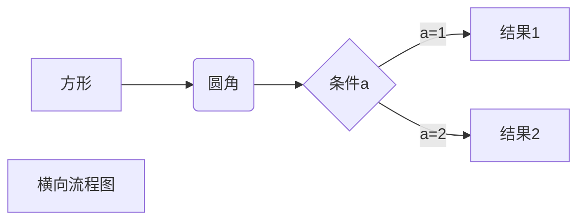
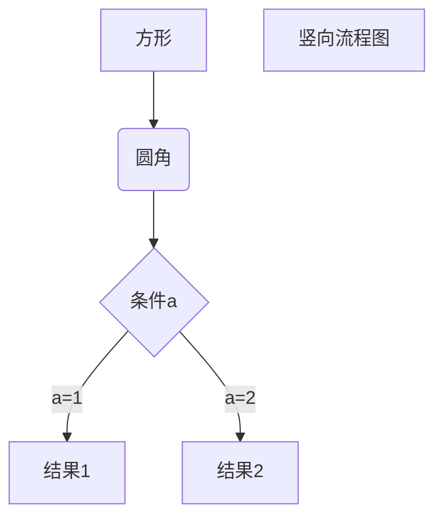
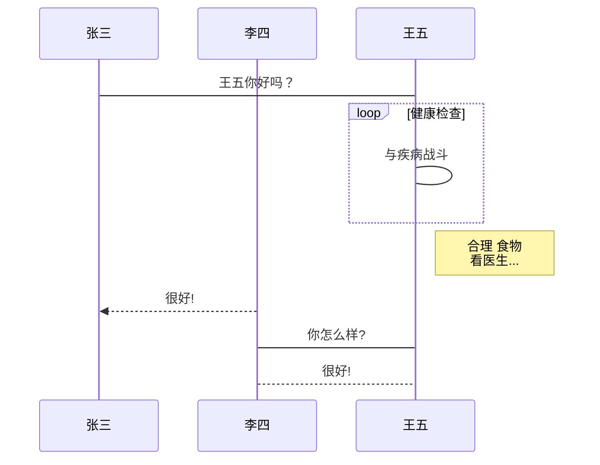
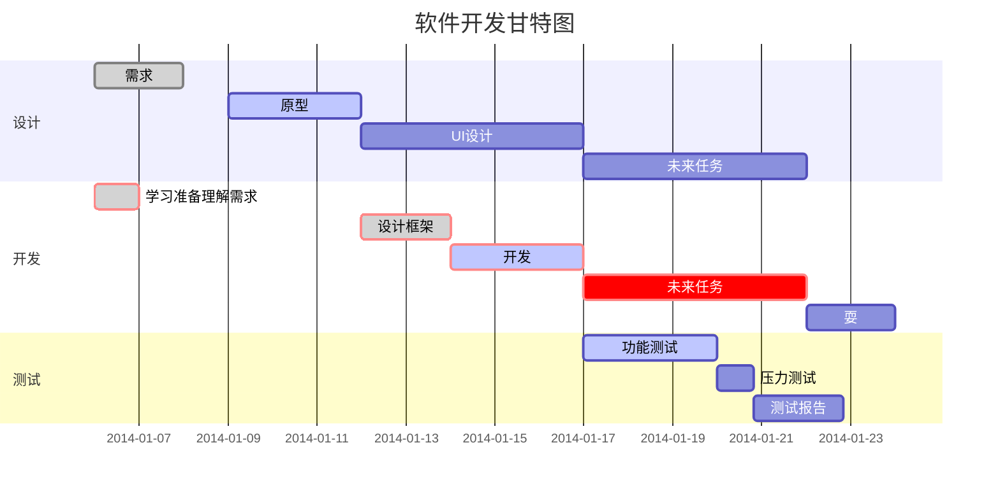

# Markdown简介

## 什么是Markdown

Markdown 是一种轻量级标记语言，它允许人们使用易读易写的纯文本格式编写文档。

# Markdown语法

## 标题

使用 # 号标记

使用 **#** 号可表示 1-6 级标题，一级标题对应一个 **#** 号，二级标题对应两个 **#** 号，以此类推。

```markdown
# 一级标题
## 二级标题
### 三级标题
#### 四级标题
##### 五级标题
###### 六级标题
```

## 段落

Markdown 段落没有特殊的格式，直接编写文字就好，**段落的换行是使用两个以上空格加上回车**。

当然也可以在段落后面使用一个空行来表示重新开始一个段落。

### 字体

```markdown
*斜体文本*
_斜体文本_
**粗体文本**
__粗体文本__
***粗斜体文本***
___粗斜体文本___
```

### 分隔线

你可以在一行中用三个以上的星号、减号、底线来建立一个分隔线，行内不能有其他东西。你也可以在星号或是减号中间插入空格。

```markdown
***

* * *

*****

- - -

----------
```

---

### 删除线

如果段落上的文字要添加删除线，只需要在文字的两端加上两个波浪线 **~~** 即可。

~~~ markdown
第一行
第二行
~~第三行~~
~~~

### 下划线

下划线可以通过 HTML 的 **<u>** 标签来实现

~~~markdown
<u>带下划线</u>
~~~

<u>带下划线</u>

### 脚注


				### 脚注

脚注是对文本的补充说明。

~~~markdown
创建脚注：[^脚注]
[^脚注]: 我是一个脚注
~~~

创建脚注：[^脚注]

[^脚注]: 我是一个脚注

## 列表

### 无序列表

无序列表使用星号(*****)、加号(**+**)或是减号(**-**)作为列表标记

```markdown
* 第一项
* 第二项
* 第三项

+ 第一项
+ 第二项
+ 第三项


- 第一项
- 第二项
- 第三项
```

* 第一项
* 第二项
* 第三项

### 有序列表

有序列表使用数字并加上 **.** 号来表示

~~~markdown
1. 第一项
2. 第二项
3. 第三项
~~~

1. 第一项
2. 第二项
3. 第三项

### 列表嵌套

列表嵌套只需在子列表中的选项添加四个空格即可

```markdown
1. 第一大项
      * 第一大项第一小项
      * 第一大基第二小项
2. 第二大项
      * 第二大项第一小项
      * 第二大项第二小项
```

1. 第一大项
       * 第一大项第一小项
       * 第一大基第二小项
2. 第二大项
       * 第二大项第一小项
       * 第二大项第二小项

## 区块

### 引用

Markdown 区块引用是在段落开头使用 **>** 符号 ，然后后面紧跟一个**空格**符号

```markdown
> 第一区块
> 第二区块
> 第三区块
```

> 第一区块

> 第二区块

> 第三区块

### 区块嵌套

另外区块是可以嵌套的，一个 **>** 符号是最外层，两个 **>** 符号是第一层嵌套，以此类推

```markdown
> 最外层
> > 第一层嵌套
> > > 第二层嵌套
```

> 最外层

> > 第一层嵌套
> >
> > > 第二层嵌套

### 区块中使用列表

```markdown
> 区块中使用列表

1. 第一项
2. 第二项

* 第一项
* 第二项
```

> 区块中使用列表
>
> 1. 第一项
> 2. 第二项
>
> * 第一项
> * 第二项

### 列表中使用区块

```markdown
1. 第一项

   > 区块1

   > 区块2

* 第二项

   > 区块3
```

1. 第一项

   >  区块1

   > 区块2

* 第二项

  > 区块3

## 代码

如果是段落上的一个函数或片段的代码可以用反引号把它包起来（`）

```markdown
`printf()` 函数
```

`printf()` 函数

### 代码区块

可以用 **```** 包裹一段代码，并指定一种语言（也可以不指定）

~~~markdown
```javascript
$(document).ready(function () {
    alert('test');
});
```
~~~

```javascript
$(document).ready(function () {
    alert('test');
});
```

## 链接

```markdown
[链接名称](链接地址)

或者

<链接地址>
```


这是个链接：[百度](https://www.baidu.com)

或者

<https://www.baidu.com>


### 高级链接

我们可以通过变量来设置一个链接，变量赋值在文档末尾进行

~~~markdonw
这是[百度][1]

这是[QQ]

[1]: http://www.baidu.com
[2]: http://www.qq.com

~~~


这是[百度][1]

这是[QQ][2]


[1]: http://www.baidu.com
[2]: http://www.qq.com


## 图片

~~~markdonw


~~~


### 变量设置

~~~markdown
这是[百度logo][3]
[3]: https://www.baidu.com/img/PCtm_d9c8750bed0b3c7d089fa7d55720d6cf.png
~~~

这是[百度logo][3]

[3]: https://www.baidu.com/img/PCtm_d9c8750bed0b3c7d089fa7d55720d6cf.png


### 高度与宽度

Markdown 还没有办法指定图片的高度与宽度，如果你需要的话，你可以使用普通的  标签

~~~markdown

~~~


## 表格

Markdown 制作表格使用 **`|`** 来分隔不同的单元格，使用 **`-`** 来分隔表头和其他行

~~~markdown
|  表头   | 表头  |
|  ----  | ----  |
| 单元格  | 单元格 |
| 单元格  | 单元格 |
~~~

| 表头   | 表头   |
| ------ | ------ |
| 单元格 | 单元格 |
| 单元格 | 单元格 |

**我们可以设置表格的对齐方式**

~~~markdown
| 左对齐 | 右对齐 | 居中对齐 |
| :-----| ----: | :----: |
| 单元格 | 单元格 | 单元格 |
| 单元格 | 单元格 | 单元格 |
~~~


| 左对齐 | 右对齐 | 居中对齐 |
| :----- | -----: | :------: |
| 单元格 | 单元格 |  单元格  |
| 单元格 | 单元格 |  单元格  |


## 高级

不在 Markdown 涵盖范围之内的标签，都可以直接在文档里面用 HTML 撰写。

目前支持的 HTML 元素有：`<kbd> <b> <i> <em> <sup> <sub> <br>`等 

~~~markdown
使用 <kbd>Ctrl</kbd>+<kbd>Alt</kbd>+<kbd>Del</kbd> 重启电脑
~~~

使用 <kbd>Ctrl</kbd>+<kbd>Alt</kbd>+<kbd>Del</kbd> 重启电脑

### 转义

Markdown 使用了很多特殊符号来表示特定的意义，如果需要显示特定的符号则需要使用转义字符，Markdown 使用反斜杠转义特殊字符

~~~markdown
**文本加粗** 
\*\* 正常显示星号 \*\*
~~~

**文本加粗**  
\*\* 正常显示星号 \*\*

Markdown 支持以下这些符号前面加上反斜杠来帮助插入普通的符号：

~~~markdown
\   反斜线
`   反引号
*   星号
_   下划线
{}  花括号
[]  方括号
()  小括号
#   井字号
+   加号
-   减号
.   英文句点
!   感叹号
~~~

### 公式

当你需要在编辑器中插入数学公式时，可以使用两个美元符 $$ 包裹 TeX 或 LaTeX 格式的数学公式来实现。提交后，问答和文章页会根据需要加载 Mathjax 对数学公式进行渲染。

~~~markdown
$$
\mathbf{V}_1 \times \mathbf{V}_2 =  \begin{vmatrix} 
\mathbf{i} & \mathbf{j} & \mathbf{k} \\
\frac{\partial X}{\partial u} &  \frac{\partial Y}{\partial u} & 0 \\
\frac{\partial X}{\partial v} &  \frac{\partial Y}{\partial v} & 0 \\
\end{vmatrix}
${$tep1}{\style{visibility:hidden}{(x+1)(x+1)}}
$$
~~~

$$
\mathbf{V}_1 \times \mathbf{V}_2 =  \begin{vmatrix} 
\mathbf{i} & \mathbf{j} & \mathbf{k} \\
\frac{\partial X}{\partial u} &  \frac{\partial Y}{\partial u} & 0 \\
\frac{\partial X}{\partial v} &  \frac{\partial Y}{\partial v} & 0 \\
\end{vmatrix}
${$tep1}{\style{visibility:hidden}{(x+1)(x+1)}}
$$

### 画图

#### 横向流程图

~~~markdown

~~~


#### 竖向流程图

~~~markdown

~~~


#### 标准流程图

~~~markdown
```flow
st=>start: 开始框
op=>operation: 处理框
cond=>condition: 判断框(是或否?)
sub1=>subroutine: 子流程
io=>inputoutput: 输入输出框
e=>end: 结束框
st->op->cond
cond(yes)->io->e
cond(no)->sub1(right)->op
```
~~~

```flow
st=>start: 开始框
op=>operation: 处理框
cond=>condition: 判断框(是或否?)
sub1=>subroutine: 子流程
io=>inputoutput: 输入输出框
e=>end: 结束框
st->op->cond
cond(yes)->io->e
cond(no)->sub1(right)->op
```

#### 标准流程图（横向）

~~~markdown
```flow
st=>start: 开始框
op=>operation: 处理框
cond=>condition: 判断框(是或否?)
sub1=>subroutine: 子流程
io=>inputoutput: 输入输出框
e=>end: 结束框
st(right)->op(right)->cond
cond(yes)->io(bottom)->e
cond(no)->sub1(right)->op
```
~~~

```flow
st=>start: 开始框
op=>operation: 处理框
cond=>condition: 判断框(是或否?)
sub1=>subroutine: 子流程
io=>inputoutput: 输入输出框
e=>end: 结束框
st(right)->op(right)->cond
cond(yes)->io(bottom)->e
cond(no)->sub1(right)->op
```

#### UML时序图

~~~markdown
```sequence
对象A->对象B: 对象B你好吗?（请求）
Note right of 对象B: 对象B的描述
Note left of 对象A: 对象A的描述(提示)
对象B-->对象A: 我很好(响应)
对象A->对象B: 你真的好吗？
```
~~~

```sequence
对象A->对象B: 对象B你好吗?（请求）
Note right of 对象B: 对象B的描述
Note left of 对象A: 对象A的描述(提示)
对象B-->对象A: 我很好(响应)
对象A->对象B: 你真的好吗？
```

#### UML时序图（复杂）

~~~markdown
```sequence
Title: 标题：复杂使用
对象A->对象B: 对象B你好吗?（请求）
Note right of 对象B: 对象B的描述
Note left of 对象A: 对象A的描述(提示)
对象B-->对象A: 我很好(响应)
对象B->小三: 你好吗
小三-->>对象A: 对象B找我了
对象A->对象B: 你真的好吗？
Note over 小三,对象B: 我们是朋友
participant C
Note right of C: 没人陪我玩
```
~~~

```sequence
Title: 标题：复杂使用
对象A->对象B: 对象B你好吗?（请求）
Note right of 对象B: 对象B的描述
Note left of 对象A: 对象A的描述(提示)
对象B-->对象A: 我很好(响应)
对象B->小三: 你好吗
小三-->>对象A: 对象B找我了
对象A->对象B: 你真的好吗？
Note over 小三,对象B: 我们是朋友
participant C
Note right of C: 没人陪我玩
```

#### UML标准时序图

~~~markdown

~~~


#### 甘特图

~~~markdown

~~~


